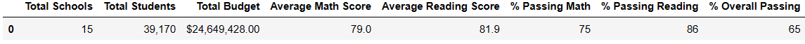
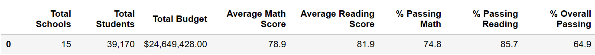
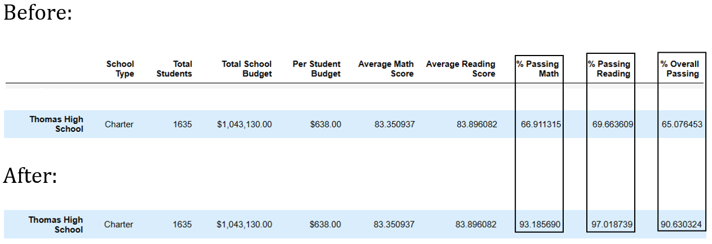
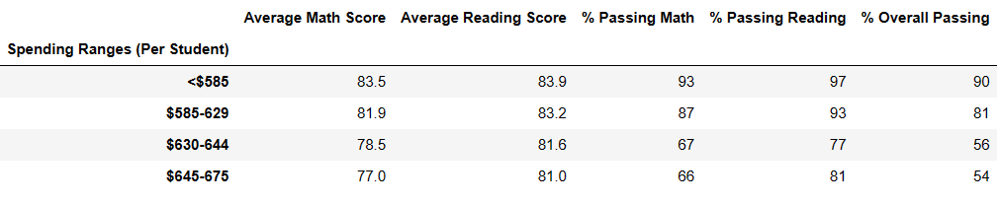
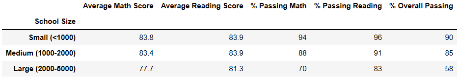
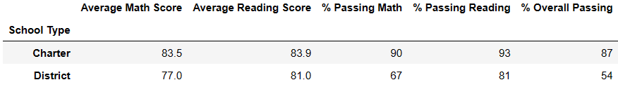

# School_District_Analysis

Analyzing School District Test Scores

## Overview of Analysis:

The analysis of the school district reading and math scores included a district summary, a school summary, the high and low performing school’s summary, a summary for overall math and reading scores, the scores by school budget summary, a summary by school size and lastly, a summary of scores by school type.

## Purpose of Analysis:

The district officials want to understand how some of the key metrics (budget/student, school size, school type) affecting the math and reading scores so that they can make decisions surrounding high schools they are responsible for. Math and reading test scores are used as key measurements of a school's performance. For instance, high performing schools are able to justify asking for more budget money. District officials will also be able to make better decisions about how to improve scores by identifying key metric anomalies.

## Results:

During the first run of results, it was apparent to the district officials 9th grade math and reading scores were skewed. It was necessary to remove all Thomas High School's 9th grade math and reading scores to get an accurate picture of what was happening at each high school.

This didn't effect district results more than a percent. Below is the before and after for the District Summary.

##### Before:

##### After:

The school summary shows that the Thomas High School's percentages went up significately, around 30%

Key Metrics :

### Scores by school spending:

This shows a positive correlation between the amount of money a school spends per student and the the students math and reading scores. The more money spent per student, the higher the scores seem to be.

### Scores by school size:

This shows a correlation between the number of students and the the students math and reading scores. The smaller the school size is, the higher the scores seem to be.

### Scores by school type:

This shows a correlation between the type of school and the the students math and reading scores. Charter schools seem to perform around ten points higher for each average and each percent measured.

Using bulleted lists and images of DataFrames as support, address the following questions.

When initially completing the analysis, all districts high
How does replacing the ninth-grade scores affect the following:
Math and reading scores by grade

Summary: Summarize four changes in the updated school district analysis after reading and math scores for the ninth grade at Thomas High School have been replaced with NaNs.

